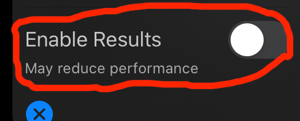

 
 <h2 align="center">Virus Spread Simulation</h2>
 <h2 align="center">Apple 2020 WWDC Swift Student Challenge Winner</h1>
 

 
 ## Welcome to my playground
 
 This is a simple simulation, which aims to demonstrate the importance of social distancing during the current global
 pandemic.
 
 Once you click Start Simulation, the simulation will begin and you will see multiple balls floating around the
 screen. These balls represent people.
 
 Social Distancing Person: 
 
 Healthy Person: 
 
 Infected Person: 
 
 Recovered Person: 
 
 The green ball represents a healthy person the red represents an infected person which after ten seconds will turn blue or recover, meaning they can no longer infect other balls. When an infected ball
 touches a healthy ball, it will infect it, hence representing the spread of the virus. If you tap on a healthy ball, a
 halo will appear around it protecting it from the infected balls and stopping it from moving. This represents the act of
 social distancing.
 
 I hope to show awareness of the obvious importance of social distancing in times like these, and to remind people that
 their reaction to the virus and whether they distance themselves or not, their individual action has consequences.
 Ultimately I want to remind people that each and every single person has an impact on the spread of the virus, and that we all
 need to act responsibly.
 
 ## Instructions
 
 This Playground was optimized to run on iPad Pro in full screen mode.
 It is important to turn off the Enable Results toggle shown on the below picture.
 
 This will increase performance and make the simulation run smoothy.
 
 The toggle is located next to Run My Code button: 
 
 Initially the balls are placed randomly on the screen.
 
 The number of balls and their speed can be easily adjusted by editing the SimParameters in the MainScene module. The duration of time after which an infected person recovers can also be adjusted in the parameters.
 
 After staring the simulation users should observe spread of the virus. Taping on green balls puts them in social distancing mode.
 
 ## Code Modules
 
 The code had been divided into three modules:
 
 MainScene - main part of the code. The SimParameters struct allows for simulation parameters adjustment
 
 SceneIntro - the initial screen text and the Start Simulation button
 
 SceneFunctions - various functions which are called from the MainScene
 
 ## References
 
 I came up with the idea for the simulation based on the Washington Post's article about Simulitis
 
 Simulitis is a Viral Disease Spread Simulation created in order to illustrate how virus spread and that a single person behavior can affect the whole population.
 
 [www.washingtonpost.com/graphics/2020/world/corona-simulator/](https://www.washingtonpost.com/graphics/2020/world/corona-simulator/)
 
 When writing my Swift code I used examples from Paul Hudson's Hacking With Swift Tutorials.
 
 Paul's site is a great resource for beginners.
 
 The ball images used in this playground had been copied over from one of the SpriteKit game tutorials on Paul's site.
 
 It is my understanding that Paul gives permission to use the code and the assets for personal projects.
 
 [www.hackingwithswift.com](https://www.hackingwithswift.com)
 
 ## Future Plans
 
 In the future I would like to add a graph to the playground to show how the amount of each type of balls change overtime.
 
 It would be also interesting to implement a feature for some percentage of infected people to die instead of fully recover.
 
 ## Enjoy the simulation!
